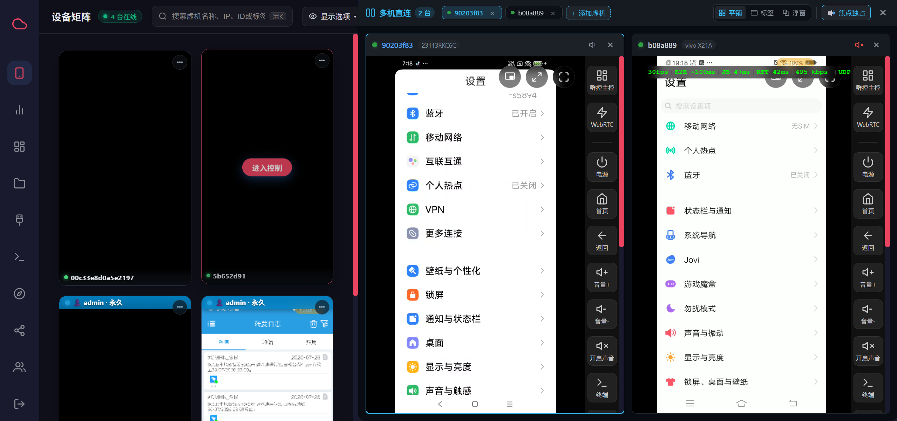
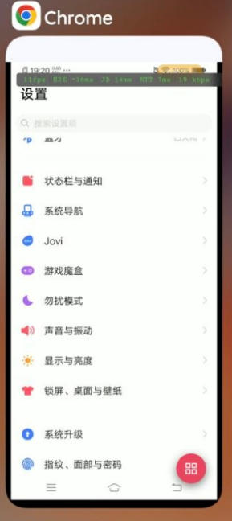
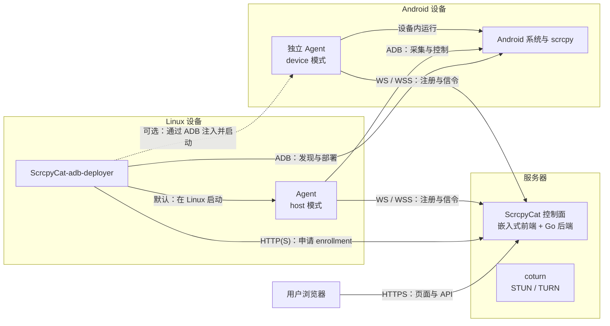
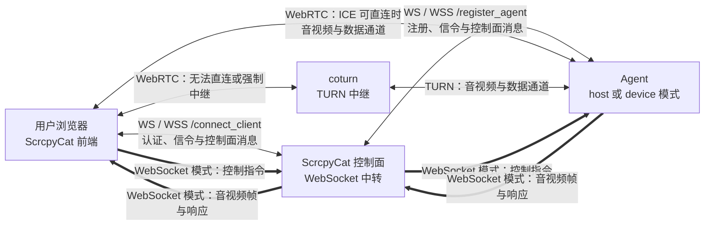

# ScrcpyCat

ScrcpyCat 是自托管的 Android 远程设备管理平台。浏览器通过 WebRTC 或 WebSocket 使用手机的屏幕、音频和终端；Go 控制平面负责账号、设备权限、分享、文件和任务，Agent 调用手机上的 scrcpy 完成采集与控制。

前端构建后嵌入 Go 可执行文件，由同一个 HTTP 服务提供网页、API 和 WebSocket。无需独立前端镜像，不包含 AI 或商业授权功能。

## 界面预览

桌面端设备控制:



移动端设备控制(云手机):



## 部署与连接关系

ScrcpyCat 控制面由嵌入式前端与 Go 后端组成，与 coturn 一同运行在服务器上。ScrcpyCat-adb-deployer 运行在可通过 ADB 访问 Android 设备的 Linux 设备上，并为每台设备选择一种 Agent 运行模式。



`host` 与 `device` 是二选一的 Agent 运行模式：默认由部署器在 Linux 上启动 host Agent，再由它通过 ADB 操作 Android；也可以把独立 Agent 部署到 Android 内运行。无论采用哪种模式，Agent 都会主动连接控制面。

浏览器建立会话时，WebRTC 信令始终由控制面的 WebSocket 转发；协商完成后的实时数据有以下路径：



coturn 不是 WebRTC 的必经节点：ICE 可直连时，浏览器直接连接 Agent；直连失败或配置为仅中继时，流量才经过 coturn。WebSocket 投屏模式则确实由控制面中转：Agent 将二进制音视频帧发送到 `/register_agent`，控制面再通过浏览器的 `/connect_client` 连接转发；控制指令和相关响应也沿相反方向转发。

## 功能

- 屏幕投屏、触控、按键、剪贴板、截图；支持 WebRTC 与 WebSocket 视频和音频。浏览器缺少 WebRTC 时，屏幕会话自动使用 WebSocket。
- 远程摄像头与麦克风、镜头切换、抓拍及浏览器录像；摄像头与分享会话需要 WebRTC。
- PTY 交互终端、单命令 Shell、文件上传下载、APK 安装与应用管理。
- 多设备列表、标签、大盘预览、平铺/标签/浮窗布局、批量任务。
- 管理员与普通用户、设备分配、独立 Shell/文件库/群控权限、画质策略、分享与卡密。
- USB 自动接入、独立 Android Agent、四种 Android ABI 工件与网页部署包。
- PostgreSQL 持久化，Redis 实时通知，coturn 中继。

设备与 Android 版本会影响音源、摄像头和编码器能力。标准手机没有的 GPS/传感器注入服务会明确报告不支持。当前功能范围是网页、Go 后端与 Agent，不包含上游的 Android App 或 Shizuku App。

## 两种 Agent 模式

| 模式 | Agent 与网络连接位置 | Android 上执行的功能 |
| --- | --- | --- |
| `host`，默认 | Linux，通过纯 Go ADB 客户端操作指定设备；WebRTC/WebSocket 使用 Linux 网络 | scrcpy、摄像头、麦克风、Shell、PTY、文件与应用 |
| `device` | 将独立 Agent 注入 Android；使用手机网络 | Agent 及所有设备功能 |

adb-deployer 按 `--mode` > `SCRCPYCAT_ADB_MODE` > `host` 选择模式。每台 USB 设备有独立 Agent 与持久身份，两种模式均保留。Linux Agent 和部署器使用 `CGO_ENABLED=0`，集成纯 Go 的 gadb；官方 ADB 可执行文件只负责启动 ADB Server。

host 采集使用前台 ADB Shell v2 和 scrcpy `cleanup=true`。ADB 会话丢失时，scrcpy 退出并恢复其管理的电源设置、释放摄像头与编码器；部署器等待设备重新接入。独立 device 模式不依赖持续 USB 连接。详见 [USB 部署说明](deploy/README.md)。

## 使用 Release 与 GHCR 部署

需要 Linux、Docker Engine 与 Compose v2。控制平面和 adb-deployer 镜像均支持 `linux/amd64`、`linux/arm64`。部署器使用 Alpine 的 `android-tools` 包，按目标架构安装 ADB；Linux Agent 与部署器本身保持纯 Go 构建。

1. 从本仓库的 Releases 下载对应架构的 `scrcpycat-<版本>-linux-<架构>.tar.gz` 和 `SHA256SUMS`，验证下载文件后解压。归档包含三个 Linux 可执行文件、四 ABI Android Agent、scrcpy server、Compose、配置样例与许可证。
2. 进入解压目录，复制并编辑配置：

   ```sh
   cp "deploy/.env.example" "deploy/.env"
   ```

   填写管理员、JWT、数据库、TURN 的配置。发布包已把镜像名设为该版本的 GHCR 标签。可信内网可使用以下地址格式：

   ```dotenv
   SCRCPYCAT_PUBLIC_URL=http://192.168.1.10:8080
   SCRCPYCAT_AGENT_SIGNALING_URL=ws://192.168.1.10:8443/register_agent
   SCRCPYCAT_CONTROLPLANE_URL=http://127.0.0.1:8443
   SCRCPYCAT_TURN_PUBLIC_IP=192.168.1.10
   SCRCPYCAT_TURN_URLS=turn:192.168.1.10:3478?transport=udp,turn:192.168.1.10:3478?transport=tcp
   ```

3. 拉取镜像并启动网页与控制平面：

   ```sh
   docker compose --env-file "deploy/.env" -f "deploy/docker-compose.yml" pull controlplane postgres redis coturn
   docker compose --env-file "deploy/.env" -f "deploy/docker-compose.yml" up -d --no-build controlplane postgres redis coturn
   ```

4. 打开 `http://<服务器地址>:8080`，管理员登录后，在「部署 → 常驻部署器凭据」创建凭据，写入 `deploy/.env` 的 `SCRCPYCAT_DEPLOYMENT_TOKEN`。它默认无限期，也可指定期限或撤销。然后启动 USB 部署器：

   ```sh
   docker compose --env-file "deploy/.env" -f "deploy/docker-compose.yml" --profile usb pull adb-deployer
   docker compose --env-file "deploy/.env" -f "deploy/docker-compose.yml" --profile usb up -d --no-build adb-deployer
   ```

5. 手机启用 USB 调试，插入服务器，并在手机上允许该 ADB 主机。部署器自动发现在线 USB 设备。仅让部署器容器持有 USB，不同时运行宿主或 Windows ADB Server。

发布镜像为 `ghcr.io/cwithw/scrcpycat:<版本>` 和 `ghcr.io/cwithw/scrcpycat-adb-deployer:<版本>`。发布后需将 GHCR 包可见性设为公开，或让部署机器使用具备读取权限的账号登录。`latest` 仅随正式版本更新，预发布使用自己的版本标签。

网页与 API 均由容器的 HTTP 8443 端口提供，Compose 默认同时映射主机 8080 和 8443，以兼容网页与 Agent 入口；端口号 8443 本身不代表已启用 TLS。公网在前面配置 HTTPS 反向代理，并允许 WebSocket 升级；相应设置 `SCRCPYCAT_PUBLIC_URL`、WSS 信令地址及 TURN 可达地址。内网 HTTP 可用，但 WebUSB 等安全上下文功能仍需 HTTPS 或 localhost。

## 从源码构建

依赖 Go 1.24+、Node.js 24、npm，以及构建 Android 工件所需的 Docker BuildKit。上游源码已随仓库保留，不需要初始化 Git submodule。

```sh
# Vite 编译并生成许可证汇总，然后嵌入 Go。
make build-controlplane

# 纯 Go 的 Linux Agent 与 USB 部署器。
make build-host-agent build-adb-deployer

# NDK 构建四 ABI 独立 Android Agent；SDK/Gradle 构建修改后的 scrcpy 4.1。
make build-agent-docker build-scrcpy-server
```

`make build-controlplane` 生成 `bin/scrcpycat-controlplane`，无需旁边保留网页资源。Android 的四 ABI 构建使用 NDK 链接 Android 运行时；这不改变 host 模式及 gadb 不使用 cgo 的设计。构建目标将环境中的代理变量传给 Docker，支持 `DOCKER_PROXY_ARGS` 覆盖。

构建并启动本地镜像时，设置本地镜像名并将上面的 `--no-build` 换为 `--build`；Dockerfile 自行完成前端编译。发布到 GHCR 的控制平面和 USB 部署器镜像均内置匹配版本的 Android Agent 与 scrcpy server 工件，不需要主机目录挂载或额外下载 Release 工件。

开发时可以启动 Vite，它会把 API 和 WebSocket 代理到 Go：

```sh
npm --prefix "frontend/web-app" ci
npm --prefix "frontend/web-app" run dev
# 在另一个终端配置所需环境变量后运行：
go run ./backend/cmd/controlplane
```

Vite 默认代理 `http://localhost:8443`，可通过 `VITE_PROXY_TARGET` 调整。Go 后端运行必须配置可达的 `SCRCPYCAT_POSTGRES_DSN` 和 `SCRCPYCAT_REDIS_URL`，原生开发时另将 `SCRCPYCAT_ASSET_DIR` 设为可写目录；内存仓库仅用于单元测试。默认 Compose 不公开数据库端口，仅调试网页时可直接代理已运行的控制平面。未编译网页时，Go 的首页返回明确的 503，API 仍可开发。

## 配置与持久化

完整样例见 [deploy/.env.example](deploy/.env.example)。

| 配置 | 用途 |
| --- | --- |
| `SCRCPYCAT_PUBLIC_URL` | 浏览器访问地址、分享链接与允许的 Origin |
| `SCRCPYCAT_AGENT_SIGNALING_URL` | Linux/Android Agent 可达的 WS/WSS 注册地址 |
| `SCRCPYCAT_CONTROLPLANE_URL` | 部署器申请 enrollment 的 HTTP/HTTPS 地址 |
| `SCRCPYCAT_ADB_MODE` | 默认 `host`；`device` 注入独立 Android Agent |
| `SCRCPYCAT_ADB_LIBUSB` | ADB Server USB 后端，默认 `0`（Linux 原生轮询）；`1` 使用 libusb |
| `SCRCPYCAT_DEPLOYMENT_TOKEN` | 仅可申请设备 enrollment 的常驻凭据 |
| `SCRCPYCAT_IMAGE` / `SCRCPYCAT_ADB_IMAGE` | 本地或 GHCR 镜像及版本 |
| `SCRCPYCAT_ADB_KEY_DIR` | 可选的宿主 ADB 密钥目录；默认使用 `adb-keys` 持久卷 |
| `SCRCPYCAT_TASK_TTL` | 离线任务 TTL，默认 `24h` |
| `SCRCPYCAT_AUDIT_RETENTION` | 审计保留时间，默认 `2160h`（90 天） |

持久卷保存 PostgreSQL、Redis、上传资产、ADB 主机密钥及每台设备的 host 身份。独立 Android Agent 身份保留在设备中。升级需保留这些状态，并使控制平面、Agent 和 scrcpy 工件版本一致。

从旧的独立 frontend 容器升级时，先停止并删除该容器以释放 8080，再按新 Compose 启动 controlplane；不需要删除数据库或其他持久卷。

## 验证与发布

```sh
go test -race ./...
make test-frontend
make release VERSION=v0.1.0 REVISION=unknown
```

`make release` 构建网页与 Android 工件，再通过 [tools/release.sh](tools/release.sh) 交叉编译 Linux amd64/arm64，生成两份 Linux 完整归档、一份 Android 工件归档与 `SHA256SUMS`，输出至 `dist/release/<版本>/`。已有工件时可直接调用脚本。发布包与镜像包含 Go/npm 依赖的许可证；网页资源内的汇总可以通过 `/THIRD_PARTY_LICENSES.txt` 读取。

[GitHub Actions](.github/workflows/ci.yml) 在 PR、main/master 推送时运行前端测试、Go race 检查与镜像构建。`vMAJOR.MINOR.PATCH` 或 `vMAJOR.MINOR.PATCH-rc.1` 标签还会构建 Android/Release 工件，推送 GHCR 镜像并创建 GitHub Release。标签格式、测试、工件和镜像构建通过后才创建 Release；发布操作使用仓库自带的 `GITHUB_TOKEN`，无需额外的长期发布密钥。

已有真实 Android 14 设备上的视频、音频、PTY、文件、摄像头及双模式验收。其他 Android 版本/ABI 的真机、真实 USB 物理拔插和多设备容量仍需要各自验证。

## 许可证

本项目自行实现的代码与修改采用 [Apache License 2.0](LICENSE)。第三方源代码保留原许可；根目录的 [NOTICE](NOTICE) 记录来源、固定快照与修改说明。

`third_party/scrcpy/LICENSE`、`frontend/LICENSE`、`third_party/gadb/LICENSE` 及额外编解码器许可证随源码保留。上游前端声明为 MIT，但对应快照未附独立 LICENSE 文件；本仓库根据其声明补入标准 MIT 文本并记录依据。Apache-2.0 不替换这些上游许可证。

## 致谢

- [scrcpy](https://github.com/Genymobile/scrcpy)：Android 采集、控制与清理机制，Apache-2.0。
- [ScrcpyOverWebRTC](https://github.com/hqw700/ScrcpyOverWebRTC)：本项目修改所基于的公开 Vue 前端，MIT。本项目未分发其专有后端、Agent 或 APK。
- [gadb](https://github.com/electricbubble/gadb)：纯 Go ADB 客户端，MIT。
- [Pion WebRTC](https://github.com/pion/webrtc)：Go WebRTC 实现。
- [Vue](https://github.com/vuejs/core)、[Pinia](https://github.com/vuejs/pinia)、[Vue Router](https://github.com/vuejs/router)、[Vite](https://github.com/vitejs/vite)：网页与构建工具。
- [Tango](https://github.com/yume-chan/ya-webadb)、[xterm.js](https://github.com/xtermjs/xterm.js)、[Apache ECharts](https://github.com/apache/echarts)：浏览器 ADB、终端和图表。
- [h264decoder](https://www.npmjs.com/package/h264decoder)、[TinyH264](https://github.com/udevbe/tinyh264)、[wasm-audio-decoders](https://github.com/eshaz/wasm-audio-decoders)、[Opus](https://opus-codec.org/)：WebSocket 视频与音频解码。
- PostgreSQL、Redis、coturn 以及依赖许可汇总中列出的开源项目。
