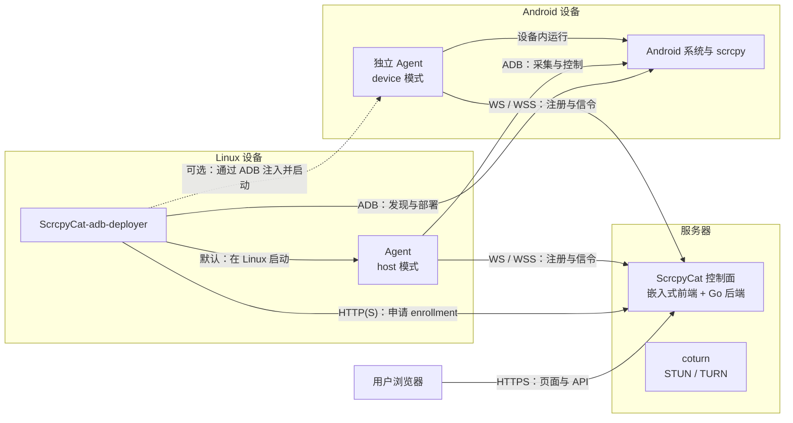
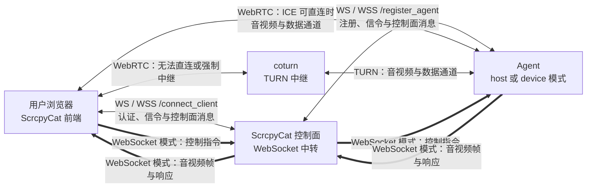

# ScrcpyCat

ScrcpyCat 是自托管的 Android 远程设备管理平台。浏览器通过 WebRTC 或 WebSocket 使用手机的屏幕、音频和终端；Go 控制平面负责账号、设备权限、分享、文件和任务，Agent 调用手机上的 scrcpy 完成采集与控制。

前端构建后嵌入 Go 可执行文件，由同一个 HTTP 服务提供网页、API 和 WebSocket。无需独立前端镜像，不包含 AI 或商业授权功能。

## 界面预览

桌面端设备控制:


移动端设备控制(云手机):


## 部署与连接关系

ScrcpyCat 控制面由嵌入式前端与 Go 后端组成，与 coturn 一同运行在服务器上。ScrcpyCat-adb-deployer 运行在可通过 ADB 访问 Android 设备的 Linux 设备上，并为每台设备选择一种 Agent 运行模式。



`host` 与 `device` 是二选一的 Agent 运行模式：默认由部署器在 Linux 上启动 host Agent，再由它通过 ADB 操作 Android；也可以把独立 Agent 部署到 Android 内运行。无论采用哪种模式，Agent 都会主动连接控制面。

浏览器建立会话时，WebRTC 信令始终由控制面的 WebSocket 转发；协商完成后的实时数据有以下路径：



coturn 不是 WebRTC 的必经节点：ICE 可直连时，浏览器直接连接 Agent；直连失败或配置为仅中继时，流量才经过 coturn。WebSocket 投屏模式则确实由控制面中转：Agent 将二进制音视频帧发送到 `/register_agent`，控制面再通过浏览器的 `/connect_client` 连接转发；控制指令和相关响应也沿相反方向转发。

## 功能

- 屏幕投屏、触控、按键、剪贴板、截图；支持 WebRTC 与 WebSocket 视频和音频。浏览器缺少 WebRTC 时，屏幕会话自动使用 WebSocket。
- 远程摄像头与麦克风、镜头切换、抓拍及浏览器录像；摄像头与分享会话需要 WebRTC。
- PTY 交互终端、单命令 Shell、文件上传下载、APK 安装与应用管理。
- 多设备列表、标签、大盘预览、平铺/标签/浮窗布局、批量任务。
- 管理员与普通用户、设备分配、独立 Shell/文件库/群控权限、画质策略、分享与卡密。
- USB 自动接入、独立 Android Agent、四种 Android ABI 工件与网页部署包。
- PostgreSQL 持久化，Redis 实时通知，coturn 中继。

设备与 Android 版本会影响音源、摄像头和编码器能力。标准手机没有的 GPS/传感器注入服务会明确报告不支持。当前功能范围是网页、Go 后端与 Agent，不包含上游的 Android App 或 Shizuku App。

## 两种 Agent 模式

| 模式 | Agent 与网络连接位置 | Android 上执行的功能 |
| --- | --- | --- |
| `host`，默认 | Linux，通过纯 Go ADB 客户端操作指定设备；WebRTC/WebSocket 使用 Linux 网络 | scrcpy、摄像头、麦克风、Shell、PTY、文件与应用 |
| `device` | 将独立 Agent 注入 Android；使用手机网络 | Agent 及所有设备功能 |

adb-deployer 按 `--mode` > `SCRCPYCAT_ADB_MODE` > `host` 选择模式。每台 USB 设备有独立 Agent 与持久身份，两种模式均保留。Linux Agent 和部署器使用 `CGO_ENABLED=0`，集成纯 Go 的 gadb；官方 ADB 可执行文件只负责启动 ADB Server。

host 采集使用前台 ADB Shell v2 和 scrcpy `cleanup=true`。ADB 会话丢失时，scrcpy 退出并恢复其管理的电源设置、释放摄像头与编码器；部署器等待设备重新接入。独立 device 模式不依赖持续 USB 连接。详见 [USB 部署说明](deploy/README.md)。

## 使用 Release 与 GHCR 部署

需要 Linux、Docker Engine 与 Compose v2。控制面和 adb-deployer 镜像均支持 `linux/amd64`、`linux/arm64`。生产环境推荐按职责拆分为以下三部分：

- Server：运行 ScrcpyCat 控制面、PostgreSQL 和 Redis。
- coturn：可选的独立 TURN 服务，可与 Server 同机或部署在另一台具有公网可达地址的服务器上。
- adb-deployer：运行在能够通过 USB/ADB 访问 Android 设备的 Linux 设备上，可以部署多台。

发布镜像为 `ghcr.io/cwithw/scrcpycat:<版本>` 和 `ghcr.io/cwithw/scrcpycat-adb-deployer:<版本>`。生产环境应固定版本标签，并确保控制面与全部 adb-deployer 使用同一版本；`latest` 仅随正式版本更新。

### Server 部署

ScrcpyCat 控制面镜像已经包含嵌入式前端、Linux/Android Agent 工件和 scrcpy server，但**不包含 coturn**。Server 只需要启动 `controlplane`、`postgres` 和 `redis`。

1. 从 Releases 下载目标架构的 `scrcpycat-<版本>-linux-<架构>.tar.gz` 与 `SHA256SUMS`，校验并解压。归档包含 Compose 文件、配置样例、各模式 Agent、scrcpy server 和许可证。

2. 复制配置样例：

   ```sh
   cp "deploy/.env.example" "deploy/.env"
   ```

3. 编辑 `deploy/.env`。生产环境至少需要设置以下内容：

   ```dotenv
   SCRCPYCAT_PUBLIC_URL=https://scrcpycat.example.com
   SCRCPYCAT_JWT_SECRET=<至少 48 字节的随机值>
   SCRCPYCAT_ADMIN_USERNAME=admin
   SCRCPYCAT_ADMIN_PASSWORD=<独立的管理员密码>
   SCRCPYCAT_POSTGRES_PASSWORD=<独立的数据库密码>
   SCRCPYCAT_IMAGE=ghcr.io/cwithw/scrcpycat:<版本>

   # 仅允许宿主上的反向代理访问控制面端口。
   SCRCPYCAT_HTTP_PORT=127.0.0.1:8080
   SCRCPYCAT_CONTROLPLANE_PORT=127.0.0.1:8443
   SCRCPYCAT_TRUSTED_PROXY_CIDRS=127.0.0.1/32,::1/128
   ```

   可使用 `openssl rand -base64 48` 生成 JWT 密钥。没有部署 coturn 时，将 `SCRCPYCAT_TURN_URLS` 设置为浏览器和 Agent 都能访问的 STUN 地址；仓库 Compose 仍要求 TURN 用户名和凭据非空，但 STUN 不会使用它们：

   ```dotenv
   SCRCPYCAT_TURN_URLS=stun:<可达的-STUN-服务器>:3478
   SCRCPYCAT_TURN_USERNAME=unused
   SCRCPYCAT_TURN_CREDENTIAL=unused
   ```

4. 仅启动 Server 所需服务：

   ```sh
   docker compose --env-file "deploy/.env" -f "deploy/docker-compose.yml" pull controlplane postgres redis
   docker compose --env-file "deploy/.env" -f "deploy/docker-compose.yml" up -d --no-build controlplane postgres redis
   docker compose --env-file "deploy/.env" -f "deploy/docker-compose.yml" ps
   curl --fail "http://127.0.0.1:8443/healthz"
   ```

5. 使用 Caddy、Nginx 等反向代理终止公网 TLS。控制面在同一个端口提供网页、API、`/connect_client` 和 `/register_agent`，反向代理必须保留 Host、覆盖客户端传入的来源 IP 请求头并支持 WebSocket。Caddy 会自动处理 WebSocket 升级，最小站点配置如下：

   ```caddyfile
   scrcpycat.example.com {
       encode zstd gzip
       reverse_proxy 127.0.0.1:8443 {
           header_up Host {host}
           header_up X-Real-IP {remote_host}
           header_up X-Forwarded-For {remote_host}
           header_up X-Forwarded-Proto {scheme}
       }
   }
   ```

   仅当反向代理确实覆盖 `X-Forwarded-For` 时，才将其地址加入 `SCRCPYCAT_TRUSTED_PROXY_CIDRS`。不要将仅提供明文 HTTP 的 8443 端口直接暴露到公网；端口号本身不代表已经启用 TLS。

### coturn 部署（可选）

coturn 用于 WebRTC 无法直连或用户强制 TURN 中继的场景，不参与 WebSocket 投屏中转。没有 coturn 时仍可使用 WebSocket，WebRTC 则取决于直连和 STUN 穿透是否成功。

以下是经实际部署验证的 Debian/Ubuntu systemd 方式。先安装 coturn：

```sh
apt-get update
apt-get install -y coturn
```

编辑 `/etc/turnserver.conf`：

```ini
listening-ip=<服务器内网 IP 或绑定 IP>
relay-ip=<服务器内网 IP 或绑定 IP>
listening-port=3478
fingerprint
lt-cred-mech
realm=scrcpycat.example.com
user=<TURN 用户名>:<强随机密码>

# 服务器经过 NAT 时使用“公网 IP/内网 IP”；直接持有公网 IP 时只填写公网 IP。
external-ip=<公网 IP>/<服务器内网 IP>

# 小规模部署可使用较窄范围；容量增大时相应扩大并同步调整防火墙。
min-port=49152
max-port=49200

no-cli
no-tls
no-dtls
no-multicast-peers
no-loopback-peers
```

若标准端口 `3478` 已被占用，可改用其他端口，例如 `3479`，并同步修改防火墙和 `SCRCPYCAT_TURN_URLS`。启动并检查服务：

```sh
systemctl enable --now coturn
systemctl status coturn --no-pager
```

防火墙和云安全组至少需要允许客户端访问 coturn 的 TCP/UDP 监听端口，并开放配置的 UDP relay 端口范围。TURN 用户名和密码必须与 Server 的 `deploy/.env` 一致：

```dotenv
SCRCPYCAT_TURN_URLS=turn:<TURN 域名或公网 IP>:3478?transport=udp,turn:<TURN 域名或公网 IP>:3478?transport=tcp
SCRCPYCAT_TURN_USERNAME=<TURN 用户名>
SCRCPYCAT_TURN_CREDENTIAL=<TURN 密码>
```

更新配置后只需重建控制面容器以重新下发 ICE 配置：

```sh
docker compose --env-file "deploy/.env" -f "deploy/docker-compose.yml" up -d --no-deps controlplane
```

也可以使用仓库 Compose 中的独立 `coturn` 服务代替 systemd：

```sh
docker compose --env-file "deploy/.env" -f "deploy/docker-compose.yml" pull coturn
docker compose --env-file "deploy/.env" -f "deploy/docker-compose.yml" up -d --no-build coturn
```

systemd 与容器方式二选一，不要让两个 coturn 实例监听同一端口。容器方式还需正确设置 `SCRCPYCAT_TURN_PUBLIC_IP`、`SCRCPYCAT_TURN_RELAY_IP` 和 relay 端口范围。

### adb-deployer 部署

adb-deployer 应部署在实际连接 Android USB 设备的 Linux 主机上。每台主机只需要部署器相关配置，不应复制 Server 的 JWT、管理员密码或数据库密码。

1. 管理员登录 ScrcpyCat，在「部署 → 常驻部署器凭据」创建凭据。凭据默认不过期，也可以设置有效期或随时撤销；原始值只显示一次。

2. 在 Linux USB 主机创建独立部署目录，例如 `/home/docker_data/scrcpycat`，并保存以下 `docker-compose.yml`：

   ```yaml
   name: scrcpycat

   services:
     adb-deployer:
       image: ${SCRCPYCAT_ADB_IMAGE:?set_an_adb_deployer_image}
       restart: unless-stopped
       env_file:
         - .env
       environment:
         SCRCPYCAT_DEPLOYMENT_TOKEN: ${SCRCPYCAT_DEPLOYMENT_TOKEN:?set_a_deployment_token}
         ADB_LIBUSB: ${SCRCPYCAT_ADB_LIBUSB:-0}
       network_mode: host
       command:
         - --mode=${SCRCPYCAT_ADB_MODE:-host}
         - --state-dir=/var/lib/scrcpycat/adb-deployer
         - --artifact-dir=/opt/scrcpycat/agent/bin
         - --scrcpy-jar=/opt/scrcpycat/scrcpy/scrcpy-server
         - --signaling=${SCRCPYCAT_AGENT_SIGNALING_URL:?set_an_agent_signaling_url}
         - --control-plane=${SCRCPYCAT_CONTROLPLANE_URL:?set_a_control_plane_url}
         - --force=${SCRCPYCAT_ADB_FORCE:-false}
       volumes:
         - /dev/bus/usb:/dev/bus/usb
         - /home/docker_data/scrcpycat/adb-keys:/root/.android
         - /home/docker_data/scrcpycat/adb-state:/var/lib/scrcpycat/adb-deployer
       device_cgroup_rules:
         - "c 189:* rmw"
       security_opt:
         - no-new-privileges:true
   ```

3. 在同一目录创建最小化 `.env`：

   ```dotenv
   SCRCPYCAT_ADB_IMAGE=ghcr.io/cwithw/scrcpycat-adb-deployer:<与控制面相同的版本>
   SCRCPYCAT_DEPLOYMENT_TOKEN=scd.<id>.<secret>
   SCRCPYCAT_ADB_MODE=host
   SCRCPYCAT_ADB_LIBUSB=0
   SCRCPYCAT_ADB_FORCE=false
   SCRCPYCAT_AGENT_SIGNALING_URL=wss://scrcpycat.example.com/register_agent
   SCRCPYCAT_CONTROLPLANE_URL=https://scrcpycat.example.com
   ```

   默认 `host` 模式在 Linux 上为每台 USB 设备启动独立 Agent，并通过 ADB 操作 Android。切换为 `device` 时，部署器会把独立 Agent 注入 Android；此时信令地址必须能够从 Android 网络直接访问。部署器使用 host 网络，以便 host Agent 发布 Linux 主机可达的 ICE 地址。

4. 启动部署器：

   ```sh
   cd "/home/docker_data/scrcpycat"
   docker compose --env-file ".env" pull adb-deployer
   docker compose --env-file ".env" up -d adb-deployer
   docker compose --env-file ".env" ps
   docker compose --env-file ".env" logs --tail=100 adb-deployer
   ```

5. Android 设备启用 USB 调试，连接 Linux 主机并允许该 ADB 主机密钥。只允许 adb-deployer 容器持有 `/dev/bus/usb`，不要同时运行宿主或其他容器中的 ADB Server，以免争用设备。`adb-keys` 和 `adb-state` 目录必须持久化，升级或重建容器时不要删除。

升级时先在 Server 和所有 USB 主机中设置同一个新版本标签，再依次执行 `docker compose pull` 与 `docker compose up -d`。控制面、adb-deployer、Agent 和 scrcpy server 版本不一致时，不保证协议与工件兼容。

## 从源码构建

依赖 Go 1.24+、Node.js 24、npm，以及构建 Android 工件所需的 Docker BuildKit。上游源码已随仓库保留，不需要初始化 Git submodule。

```sh
# Vite 编译并生成许可证汇总，然后嵌入 Go。
make build-controlplane

# 纯 Go 的 Linux Agent 与 USB 部署器。
make build-host-agent build-adb-deployer

# NDK 构建四 ABI 独立 Android Agent；SDK/Gradle 构建修改后的 scrcpy 4.1。
make build-agent-docker build-scrcpy-server
```

`make build-controlplane` 生成 `bin/scrcpycat-controlplane`，无需旁边保留网页资源。Android 的四 ABI 构建使用 NDK 链接 Android 运行时；这不改变 host 模式及 gadb 不使用 cgo 的设计。构建目标将环境中的代理变量传给 Docker，支持 `DOCKER_PROXY_ARGS` 覆盖。

构建并启动本地镜像时，设置本地镜像名并将上面的 `--no-build` 换为 `--build`；Dockerfile 自行完成前端编译。发布到 GHCR 的控制平面和 USB 部署器镜像均内置匹配版本的 Android Agent 与 scrcpy server 工件，不需要主机目录挂载或额外下载 Release 工件。

开发时可以启动 Vite，它会把 API 和 WebSocket 代理到 Go：

```sh
npm --prefix "frontend/web-app" ci
npm --prefix "frontend/web-app" run dev
# 在另一个终端配置所需环境变量后运行：
go run ./backend/cmd/controlplane
```

Vite 默认代理 `http://localhost:8443`，可通过 `VITE_PROXY_TARGET` 调整。Go 后端运行必须配置可达的 `SCRCPYCAT_POSTGRES_DSN` 和 `SCRCPYCAT_REDIS_URL`，原生开发时另将 `SCRCPYCAT_ASSET_DIR` 设为可写目录；内存仓库仅用于单元测试。默认 Compose 不公开数据库端口，仅调试网页时可直接代理已运行的控制平面。未编译网页时，Go 的首页返回明确的 503，API 仍可开发。

## 配置与持久化

完整样例见 [deploy/.env.example](deploy/.env.example)。

| 配置 | 用途 |
| --- | --- |
| `SCRCPYCAT_PUBLIC_URL` | 浏览器访问地址、分享链接与允许的 Origin |
| `SCRCPYCAT_AGENT_SIGNALING_URL` | Linux/Android Agent 可达的 WS/WSS 注册地址 |
| `SCRCPYCAT_CONTROLPLANE_URL` | 部署器申请 enrollment 的 HTTP/HTTPS 地址 |
| `SCRCPYCAT_ADB_MODE` | 默认 `host`；`device` 注入独立 Android Agent |
| `SCRCPYCAT_ADB_LIBUSB` | ADB Server USB 后端，默认 `0`（Linux 原生轮询）；`1` 使用 libusb |
| `SCRCPYCAT_DEPLOYMENT_TOKEN` | 仅可申请设备 enrollment 的常驻凭据 |
| `SCRCPYCAT_IMAGE` / `SCRCPYCAT_ADB_IMAGE` | 本地或 GHCR 镜像及版本 |
| `SCRCPYCAT_ADB_KEY_DIR` | 可选的宿主 ADB 密钥目录；默认使用 `adb-keys` 持久卷 |
| `SCRCPYCAT_TASK_TTL` | 离线任务 TTL，默认 `24h` |
| `SCRCPYCAT_AUDIT_RETENTION` | 审计保留时间，默认 `2160h`（90 天） |

持久卷保存 PostgreSQL、Redis、上传资产、ADB 主机密钥及每台设备的 host 身份。独立 Android Agent 身份保留在设备中。升级需保留这些状态，并使控制平面、Agent 和 scrcpy 工件版本一致。

从旧的独立 frontend 容器升级时，先停止并删除该容器以释放 8080，再按新 Compose 启动 controlplane；不需要删除数据库或其他持久卷。

## 验证与发布

```sh
go test -race ./...
make test-frontend
make release VERSION=v0.1.0 REVISION=unknown
```

`make release` 构建网页与 Android 工件，再通过 [tools/release.sh](tools/release.sh) 交叉编译 Linux amd64/arm64，生成两份 Linux 完整归档、一份 Android 工件归档与 `SHA256SUMS`，输出至 `dist/release/<版本>/`。已有工件时可直接调用脚本。发布包与镜像包含 Go/npm 依赖的许可证；网页资源内的汇总可以通过 `/THIRD_PARTY_LICENSES.txt` 读取。

[GitHub Actions](.github/workflows/ci.yml) 在 PR、main/master 推送时运行前端测试、Go race 检查与镜像构建。`vMAJOR.MINOR.PATCH` 或 `vMAJOR.MINOR.PATCH-rc.1` 标签还会构建 Android/Release 工件，推送 GHCR 镜像并创建 GitHub Release。标签格式、测试、工件和镜像构建通过后才创建 Release；发布操作使用仓库自带的 `GITHUB_TOKEN`，无需额外的长期发布密钥。

已有真实 Android 14 设备上的视频、音频、PTY、文件、摄像头及双模式验收。其他 Android 版本/ABI 的真机、真实 USB 物理拔插和多设备容量仍需要各自验证。

## 许可证

本项目自行实现的代码与修改采用 [Apache License 2.0](LICENSE)。第三方源代码保留原许可；根目录的 [NOTICE](NOTICE) 记录来源、固定快照与修改说明。

`third_party/scrcpy/LICENSE`、`frontend/LICENSE`、`third_party/gadb/LICENSE` 及额外编解码器许可证随源码保留。上游前端声明为 MIT，但对应快照未附独立 LICENSE 文件；本仓库根据其声明补入标准 MIT 文本并记录依据。Apache-2.0 不替换这些上游许可证。

## 致谢

- [scrcpy](https://github.com/Genymobile/scrcpy)：Android 采集、控制与清理机制，Apache-2.0。
- [ScrcpyOverWebRTC](https://github.com/hqw700/ScrcpyOverWebRTC)：本项目修改所基于的公开 Vue 前端，MIT。本项目未分发其专有后端、Agent 或 APK。
- [gadb](https://github.com/electricbubble/gadb)：纯 Go ADB 客户端，MIT。
- [Pion WebRTC](https://github.com/pion/webrtc)：Go WebRTC 实现。
- [Vue](https://github.com/vuejs/core)、[Pinia](https://github.com/vuejs/pinia)、[Vue Router](https://github.com/vuejs/router)、[Vite](https://github.com/vitejs/vite)：网页与构建工具。
- [Tango](https://github.com/yume-chan/ya-webadb)、[xterm.js](https://github.com/xtermjs/xterm.js)、[Apache ECharts](https://github.com/apache/echarts)：浏览器 ADB、终端和图表。
- [h264decoder](https://www.npmjs.com/package/h264decoder)、[TinyH264](https://github.com/udevbe/tinyh264)、[wasm-audio-decoders](https://github.com/eshaz/wasm-audio-decoders)、[Opus](https://opus-codec.org/)：WebSocket 视频与音频解码。
- PostgreSQL、Redis、coturn 以及依赖许可汇总中列出的开源项目。
